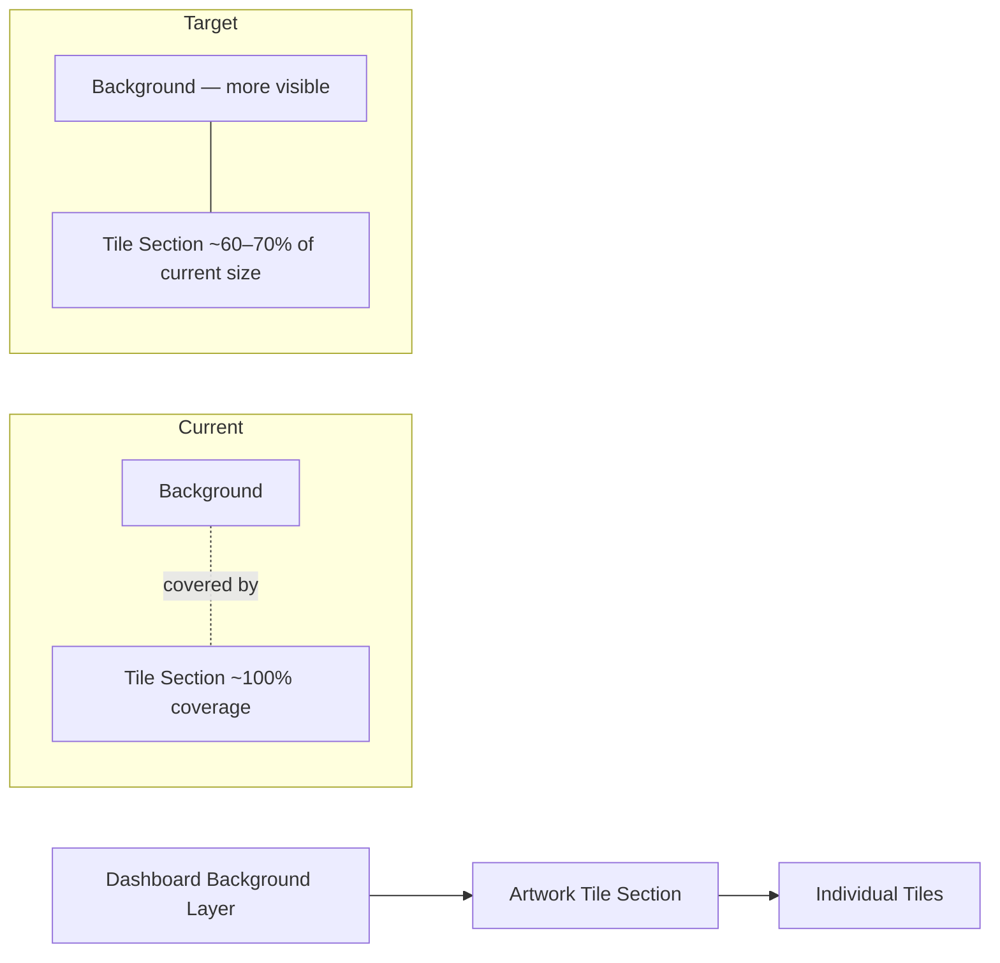

# pacifica

**Type:** Brownfield
**Repository:** pandeiro/pacifica
**Created:** Mar 25, 2026
**Status:** Draft

---

## Overview
Pandeiro/Pacifica is an existing dashboard application that displays artwork tiles over a background. This change reduces the overall footprint of the artwork tile section so that more of the dashboard background is visible.

## Problem
The current artwork tiles cover too much of the dashboard background, obscuring it. The developer wants the background to show through more, creating a better visual balance between the artwork tiles and the background beneath them.

## Scope

### In scope
- Reducing the overall size/coverage of the artwork tile section on the dashboard
- Potentially reducing the size of individual tiles as a means to achieve the smaller overall footprint
- Deploying and reviewing the change on a feature branch in the staging environment

### Out of scope
- Changes to the number of artwork pieces displayed
- Changes to artwork rotation frequency or logic
- Changes to background artwork or assets themselves
- Production deployment (at this stage)
- User-facing testing or gathering external feedback

## Functional Requirements
1. The artwork tile section shall occupy less of the dashboard surface area than it currently does — a starting target of 60–70% of current size, subject to visual review.
2. Individual tile sizes may be reduced proportionally as part of achieving the smaller overall footprint.
3. The dashboard background shall be visibly exposed around or behind the reduced tile area.
4. The change shall be implemented on a dedicated feature branch and deployed to the staging environment for review before any merge.
5. Final acceptance of tile sizing shall be determined by the developer's visual judgment in staging — no automated size threshold is required to pass.

## Technical Notes
- This is a brownfield change; existing layout patterns for the dashboard tile section should be identified and followed rather than replaced wholesale.
- Start at roughly 60–70% of the current tile section size as the first iteration point; expect at least one round of eyeball adjustment in staging before the size is locked.
- Avoid changes that would break existing tile interaction behavior (click targets, hover states, etc.) — only size and layout properties are in scope.
- Current stack details were not provided in the spec — confirm the CSS/layout approach (e.g., CSS Grid, Flexbox, absolute positioning, a component library) before writing the implementation so the resize approach matches existing patterns.

## Architecture

## Open Questions
- What is the current layout/CSS mechanism used for the artwork tile section (Grid, Flexbox, absolute positioning, component library)? This needs to be confirmed before implementation to ensure the resize follows existing patterns.
- Is there a minimum tile size below which tiles become hard to read or interact with? No lower bound was defined.
- Should the tile section remain centered, anchored to a corner, or stay in its current position as it shrinks?

## Future / Parking Lot
- User feedback loop: collecting external input on the artwork display was explicitly deferred — the developer will evaluate by feel first.
- Further artwork display improvements (contrast, prominence, rotation frequency) were raised as possibilities but not pursued in this change.
