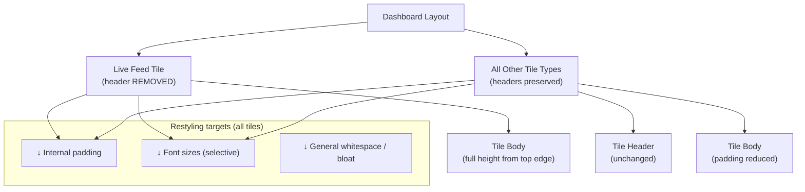

# pacifica

**Type:** Brownfield
**Repository:** pandeiro/pacifica
**Created:** Mar 25, 2026
**Status:** Draft

---

## Overview

Pacifica is an existing dashboard application featuring a tile-based layout. This document covers a focused visual tightening pass to reduce tile footprint and expose more of the dashboard background.

## Problem

Dashboard tiles are oversized and visually bloated, consuming too much screen real estate and obscuring the background UI. Excess padding, unnecessary headers on certain tile types, and potentially oversized typography are contributing to the crowded feel. The goal is to make the dashboard feel lighter and more spacious without sacrificing readability.

## Scope

### In scope

- Remove the header completely from the live feed tile
- Reduce padding inside tiles (all tile types, developer discretion on amount)
- Audit and adjust font sizes across tile elements (labels, values, etc.) where reduction aids density without hurting legibility — developer has creative discretion
- Any additional micro-adjustments (line-height, gap, margin) the developer judges necessary to achieve a noticeably smaller, less bloated tile appearance

### Out of scope

- Changing tile content, data, or functionality
- Redesigning the background itself
- Structural grid or layout changes beyond what naturally results from smaller tiles
- Adding collapse/hide behavior to headers (header removal on live feed tile is a hard delete, not a toggle)
- Responsive/breakpoint-specific rules (not discussed; see Open Questions)

## Functional Requirements

1. **Live feed tile header removed:** The live feed tile must render with no header element and no reserved space where the header previously appeared — the tile body occupies the full tile area from the top edge.
2. **All other tile headers preserved:** No other tile type loses its header as a result of this change.
3. **Padding reduced across tiles:** All tiles must have visibly less internal padding than the current state; the exact value is developer-judged but must be perceptibly different when compared side-by-side.
4. **Font sizes assessed and selectively reduced:** At minimum, tile label and/or data-value font sizes must be reviewed; any reduction applied must maintain legibility at normal viewing distance.
5. **Background more visible:** After all changes are applied, more dashboard background must be visible than in the pre-change state — this is the primary acceptance signal.
6. **No functional regressions:** All tile interactions, data display, and navigation that existed before must continue to work after the changes.

## Technical Notes

- Stack details were not stated in the transcript. Follow existing component and styling patterns already in the repository (CSS modules, Tailwind classes, styled-components, etc. — match whatever is already in use).
- Treat this as a surgical restyling pass, not a component refactor. Minimize the diff surface to reduce regression risk.
- The live feed tile header removal should be a clean delete of the header markup and any associated styles/spacing, not a conditional render behind a flag (no new props or feature toggles needed for this scope).
- Font-size changes should use the existing scale/tokens if the project has a design system — do not introduce raw pixel values if a token already covers the target size.
- Padding reductions should similarly use existing spacing scale steps where possible (e.g., step down one unit on the scale rather than setting arbitrary values).

## Architecture

## Open Questions

- **Which tiles count as "live feed"?** Is there exactly one live feed tile, or are there multiple instances/variants? Removal should target the right component(s).
